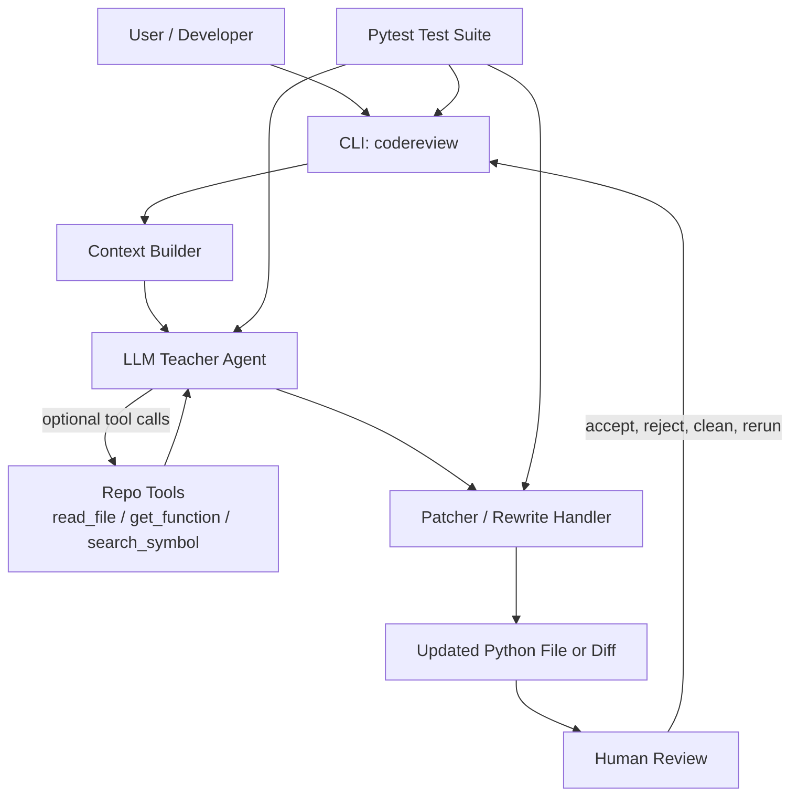

# codereview

`codereview` is a Python CLI that turns an LLM into a strict senior-teacher assistant for one file at a time. It matters because it moves AI help closer to how engineers actually work: inspect a real file, pull supporting context from the repo, make a constrained judgment, and either leave precise inline comments or propose a small, reviewable change.

## Original Project Lineage

This project evolved from my original Modules 1-3 project, also named `codereview`. The original version focused on reviewing a single Python file and injecting inline `# REVIEW:` comments so AI feedback felt more like pull-request feedback than a chat response. This version keeps that core workflow, then extends it with an agentic tool loop, dry-run diff review, and a stricter "teacher" persona that can also propose small full-file rewrites when the request is explicit and narrow.

## Title And Summary

`codereview` helps a developer inspect one Python file at a time using an LLM that behaves like a demanding but fair code mentor. The system builds local project context, optionally lets the model inspect more of the repo through tools, and then returns either inline review comments or a focused rewrite that the human can apply directly or preview as a diff first.

Demo video: https://www.loom.com/share/89a78707c5694347a502fe4e5d7fa727

## Architecture Overview

The system has five main parts:

- `CLI`: validates arguments, handles `--dry-run` and `--clean`, and writes results back to disk.
- `Context Builder`: collects a lightweight project skeleton, directly imported local files, and the numbered target file.
- `LLM Teacher Agent`: applies the teacher-style prompt, decides whether to comment or rewrite, and can request tools when context is insufficient.
- `Repo Tools`: `read_file`, `get_function`, and `search_symbol` provide targeted repo access during the agent loop.
- `Patcher / Rewrite Handler`: injects `# REVIEW:` lines, strips them, or prepares a full-file rewrite diff.

Data flows from the developer into the CLI, through context construction and the model loop, and back out as either an updated file or a dry-run diff. Human review remains in the loop through the dry-run confirmation flow, and automated tests check the CLI, patching logic, and tool-call loop.

Mermaid source for the diagram is stored in [assets/system-diagram.mmd](/Users/bogningguy-robert/Desktop/codereview/assets/system-diagram.mmd).

Rendered diagram:




## Project Layout

- `codereview/`: CLI entrypoint, prompt, context builder, patcher, config, and tool loop.
- `codereview/tools/`: tool schemas, registry, and repo-inspection tool implementations.
- `tests/`: unit tests for patching, LLM flow, and CLI behavior.
- `trial/`: intentionally flawed Python fixtures for manual testing.
- `assets/`: architecture diagrams and screenshots for documentation.

## Setup Instructions

1. Clone the repository.
2. Install dependencies:

```bash
uv sync
```

3. Set your OpenAI API key in the environment or in a local `.env` file:

```bash
export OPENAI_API_KEY=your_key_here
```

4. Install the CLI globally from the repo:

```bash
uv tool install --editable .
```

5. Run the tool on a Python file:

```bash
codereview --file trial/buggy_service.py "review this file"
```

You can also run the tests:

```bash
uv run pytest
```

## Sample Interactions

### 1. Comment mode

Input:

```bash
codereview --file trial/buggy_service.py "review this file"
```

Representative output:

```text
[codereview] assisting /.../trial/buggy_service.py
[codereview] starting model turn 1
[codereview] no tool calls requested; parsing final response
5 reviews added to /.../trial/buggy_service.py
```

Representative injected comments:

```python
# REVIEW: check_same_thread=False with a shared connection is unsafe; your lock only covers writes, not concurrent reads and connection lifecycle.
conn = sqlite3.connect(DB_PATH, check_same_thread=False)
```

### 2. Rewrite mode

Input:

```bash
codereview --file trial/buggy_service.py "fix the SQLite path handling"
```

Representative output:

```text
updated /.../trial/buggy_service.py
```

In this mode the model returns a full rewritten file wrapped in `FILE_START` / `FILE_END`, and the CLI applies it directly or shows a diff first if `--dry-run` is used.

### 3. Cross-file inspection

Input:

```bash
codereview --file trial/force_tool_review.py "review this file and verify related helper behavior before commenting"
```

Representative output:

```text
[codereview] model requested tool `read_file`
[codereview] running tool `read_file` with args {"file_path":"trial/hidden_rules.py"}
```

This fixture is designed so the visible file is not enough on its own; the model is more likely to inspect helper layers before commenting.

## Design Decisions

- I kept the scope to one Python file per run. That keeps context assembly simple and makes edits reviewable.
- I used a small tool set instead of broad repo access. The model can inspect more code, but only through narrow, testable operations.
- I separated comment mode from rewrite mode. That reduces the risk of broad, low-confidence edits when the user only wanted critique.
- I kept a human approval step in dry-run mode. This matters because even good AI suggestions should still be treated as proposed changes, not automatic truth.

The main trade-off is capability versus predictability. A larger context window and more aggressive repo traversal could make the model smarter, but it would also make behavior harder to reason about and easier to overfit to irrelevant files.

## Testing Summary

This project uses several reliability checks instead of trusting the model blindly:

- Automated tests: the current suite passes `33/33` tests and covers patch injection, cleaning, dry-run diff behavior, rewrite handling, CLI validation, and the agent loop's tool-call flow.
- Logging and error handling: the CLI prints model and tool activity while running, and tool failures are returned to the model as explicit error strings instead of failing silently.
- Human evaluation: `--dry-run` keeps a human in the loop by writing a diff, opening it for inspection, and requiring confirmation before changing the file.

In short, the deterministic parts of the system are well covered and stable. The weaker area is model judgment itself: tool use is available and tested, but it is not guaranteed on every prompt because the model may decide the initial context is already sufficient.

## Reflection

This project taught me that useful AI systems are mostly about boundaries, not just prompts. The hard parts were defining what context the model should see, constraining how it is allowed to inspect the repo, and deciding when AI output should be treated as a suggestion versus an applied change.

It also reinforced that good AI-assisted workflows still need ordinary software engineering discipline: validation, test coverage, observability, and a human checkpoint before risky edits. The model is only one component; the real system is the loop around it.

## Portfolio Artifact

GitHub repository: https://github.com/bamiboy237/applied-ai-system-project

What this project says about me as an AI engineer:

This project shows that I treat AI engineering as applied systems work rather than prompt theater. I focus on building constrained, testable workflows around the model, with clear failure handling, human review, and enough observability to understand what the AI did and why.

## Constraints

- Python files only.
- One target file per run.
- `--clean` cannot be combined with `--dry-run` or an instruction.
- `.env` should remain local and should not be committed.
