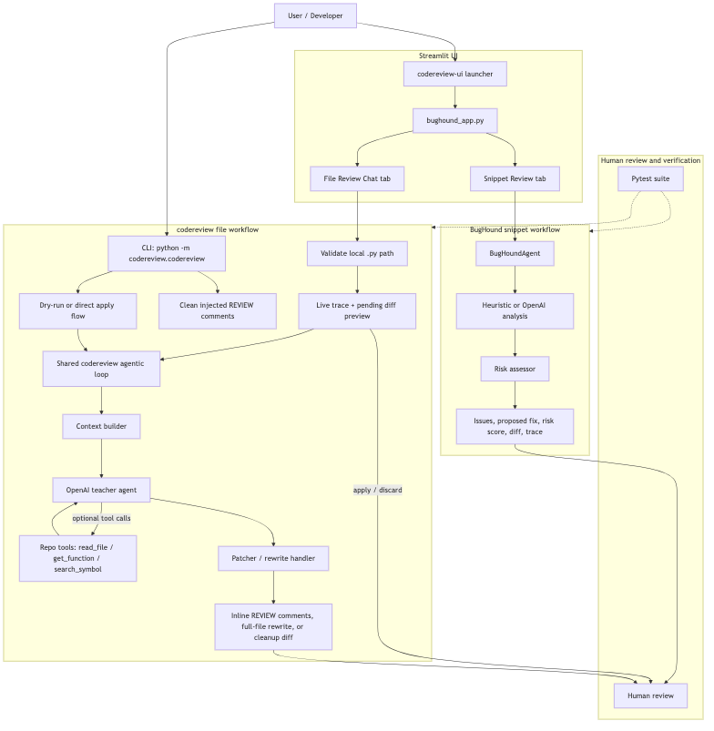

# BugHound + codereview

BugHound + `codereview` is an applied AI code-review project built on top of the original BugHound starter. The starter workflow stays first-class: a Streamlit app analyzes a Python snippet, proposes a fix, scores risk, and shows an agent trace. The extension layer is my original `codereview` project, a Python file-review tool that turns an LLM into a strict senior-teacher assistant for one file at a time.

`codereview` matters because it moves AI help closer to how engineers actually work: inspect a real file, pull supporting context from the repo, make a constrained judgment, and either leave precise inline comments or propose a small, reviewable change.

The result is a two-surface system for AI-assisted Python review:

- BugHound UI: fast snippet-level analysis with offline heuristics or OpenAI, plus a file-review chat tab that previews `codereview` diffs before writing.
- `codereview` CLI: file-level review with project context, an agentic tool loop, inline `# REVIEW:` comments, cleanup, dry-run diff review, and focused rewrite mode.

## Original Project Lineage

My ground-up project was `codereview`, a Python CLI that makes AI feedback feel like pull-request review instead of a chat answer. It injects comments directly above risky lines, can inspect nearby project files through narrow tools, and keeps file mutation behind either explicit user intent or a dry-run approval step.

This final version keeps the starter BugHound agent as the visible reliability workflow, then uses `codereview` as the deeper file-review layer. That matters because my original mistake was building beside the starter instead of building on it. This version is meant to show both: I can use the provided base, and I can still bring in the stronger parts of the system I built from scratch.

The imported `codereview` behavior keeps the original scope: single-file review, Python only, narrow repo tools, in-place comments, `--dry-run` diff preview, and `--clean` to strip injected comments.

## Architecture

Mermaid source for the diagram is stored in [assets/system-diagram.mmd](/Users/bogningguy-robert/Desktop/ai110-module5tinker-bughound-starter/assets/system-diagram.mmd).

Rendered diagram:



The `codereview` model contract is intentionally tight. In comment mode, the model is expected to return lines like:

```text
REVIEW:<line>: <short why-it-is-bad and pointer to fix>
```

Rewrite mode is reserved for explicit, narrow requests. In that case the model returns a full rewritten file wrapped in `FILE_START` / `FILE_END`, and the CLI or UI turns that into a diff or applied update.

## Project Layout

- `bughound_app.py`: Streamlit UI with `Snippet Review` and `File Review Chat` tabs.
- `bughound_agent.py`: plan, analyze, act, test, reflect workflow.
- `llm_client.py`: offline mock client and OpenAI Responses API client.
- `reliability/risk_assessor.py`: deterministic risk scoring and auto-fix gate.
- `codereview/`: CLI entrypoint, OpenAI teacher loop, context builder, patcher, config, and repo tools.
- `codereview-ui`: repo-level launcher for the Streamlit app.
- `codereview_ui.py`: launcher implementation that resolves `bughound_app.py` from the repo path.
- `codereview/tools/`: constrained model-callable tools for local repo inspection.
- `prompts/`: BugHound analyzer/fixer templates and the `codereview` teacher-agent system prompt.
- `sample_code/`: small snippets for the Streamlit UI.
- `trial/`: intentionally flawed Python files for `codereview` demos.
- `tests/`: unit tests for BugHound, risk scoring, patching, CLI behavior, and the tool-call loop.
- `assets/`: architecture diagram source and rendered image.

## Setup

Create and activate a virtual environment:

```bash
python -m venv .venv
source .venv/bin/activate
```

Install dependencies:

```bash
pip install -r requirements.txt
```

If your local venv does not include `pip`, use `uv`:

```bash
uv pip install -r requirements.txt
```

Install the repo commands globally with `uv tool`:

```bash
uv tool install --editable .
```

This exposes:

```bash
codereview
codereview-ui
```

For OpenAI-backed runs, copy the example environment file:

```bash
cp .env.example .env
```

Then set:

```text
OPENAI_API_KEY=your_real_key_here
```

## Demo: BugHound UI

Run:

```bash
codereview-ui
```

This launches:

```bash
streamlit run bughound_app.py
```

The launcher resolves `bughound_app.py` relative to the installed project, so it can be run from a different working directory. If Streamlit is missing, it prints a readable dependency error. The repo-local `./codereview-ui` wrapper is also available for running directly from a clone.

Snippet demo flow:

1. Select `Heuristic only (no API)` for a fully offline run.
2. Load `mixed_issues.py` from the sample picker.
3. Click `Run BugHound`.
4. Show the detected issues, proposed fix, unified diff, risk score, and agent trace.
5. Switch to `OpenAI (requires API key)` only if `.env` contains `OPENAI_API_KEY`.

The offline demo is reliable because it uses deterministic rules. OpenAI mode is useful for richer findings, but the risk assessor still runs locally afterward.

File review demo flow:

1. Open the `File Review Chat` tab.
2. Enter a local Python file path, such as `trial/buggy_service.py`.
3. Enter an instruction, such as `review this file`.
4. Click `Preview review` to show the file preview and generated diff.
5. Watch the live `codereview` agent trace while the model runs, including model turns and tool calls.
6. Click `Apply pending changes` only after reviewing the diff, or `Discard preview`.
7. Use `Preview cleanup` to remove injected `# REVIEW:` comments through the same confirmation flow.

## Demo: codereview CLI

Comment mode:

```bash
python -m codereview.codereview --file trial/buggy_service.py "review this file"
```

Expected result: the CLI adds a small number of `# REVIEW:` comments above risky lines.

Dry-run mode:

```bash
python -m codereview.codereview --file trial/buggy_service.py --dry-run "review this file"
```

Expected result: the CLI writes a unified diff to `/tmp`, opens it in the configured editor when available, and asks whether to apply the patch.

Clean mode:

```bash
python -m codereview.codereview --file trial/buggy_service.py --clean
```

Expected result: all injected `# REVIEW:` comments are removed. This is useful after a demo so the fixture can be reused.

Cross-file inspection demo:

```bash
python -m codereview.codereview --file trial/force_tool_review.py "review this file and verify related helper behavior before commenting"
```

Expected result: the model can request tools such as `read_file`, `get_function`, or `search_symbol` when the target file alone is not enough.

## Testing

Run the full suite:

```bash
python -m pytest -q
```

Current verification:

```text
53 passed
```

The tests cover:

- BugHound offline workflow shape and fallback behavior.
- Risk scoring and auto-fix guardrails.
- `codereview` patch injection and cleanup.
- `codereview-ui` launcher path resolution and missing-Streamlit errors.
- Context filtering for generated and dependency folders.
- File-review UI validation and preview helpers.
- Dry-run diff handling.
- CLI validation.
- OpenAI teacher-loop parsing.
- Tool-call dispatch and tool-error handling.

## Design Decisions

- I kept BugHound snippet review and `codereview` file review separate. The UI is better for explaining the agent workflow; the CLI is better for realistic file review.
- I added `codereview-ui` as a small launcher instead of changing CLI semantics. The existing `python -m codereview.codereview ...` commands remain unchanged.
- I kept heuristic mode because the demo should still work without network access or an API key.
- I kept `codereview` scoped to one Python file per run because broad AI edits are harder to inspect and easier to trust too quickly.
- I gave the model narrow tools instead of broad filesystem access. That makes the system easier to test and safer to explain.
- I exclude dependency and generated folders such as `.venv`, `.git`, `__pycache__`, `node_modules`, `build`, and `dist` from automatic context construction and symbol search. This came directly from the original `codereview` model-card concern about context bloat and accidental exposure.
- I used dry-run diffs before risky file mutation because AI suggestions should still pass through human review.
- I made the file-review UI preview comments, rewrites, and cleanup before applying them because arbitrary local file paths need a visible confirmation checkpoint.

## Constraints

- Python source files are the supported target for `codereview`.
- `codereview` reviews one target file per run.
- `--clean` cannot be combined with `--dry-run` or a review instruction.
- BugHound snippet analysis is intentionally lightweight and should not be treated as a full static analyzer.
- OpenAI mode requires `OPENAI_API_KEY`.
- Model output can still be wrong, incomplete, or overconfident; local guardrails and human review are part of the system by design.
